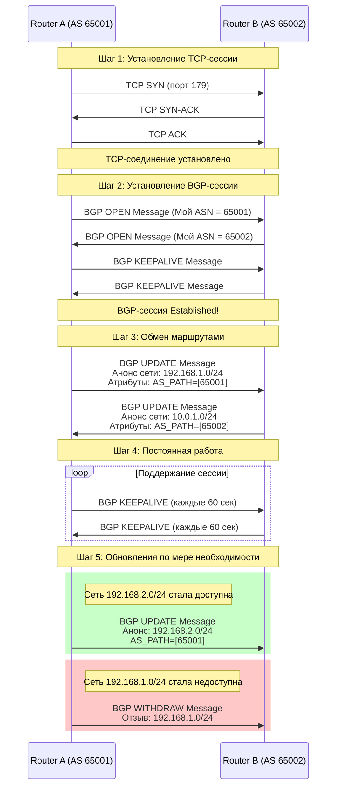

### Что такое BGP? Основная идея

Представьте себе мир интернета как огромную сеть стран, каждая из которых — это отдельная сеть (Автономная Система, AS). Внутри одной страны (AS) жители перемещаются по своим внутренним дорогам (это **IGP** — OSPF, EIGRP). Но чтобы попасть из одной страны в другую, вам нужны **международные магистрали** и **таможенники**, которые знают, куда ведет каждая дорога.

**BGP (Border Gateway Protocol)** — это и есть протокол "таможенников" и "международных карт". Это не протокол для быстрой маршрутизации внутри сети, а протокол для **обмена информацией о доступности сетей** между разными автономными системами.

**Ключевая аналогия:**
*   **Почтовая служба (Внутренняя):** OSPF/EIGRP. Быстро доставляет письма внутри одного города (AS).
*   **Международная почта (BGP):** Обменивается информацией с другими странами: "Через меня можно доставить письмо в сеть 8.8.8.0/24, которая находится в стране AS15169 (Google)".

---

### Из чего состоит BGP? Основные компоненты

1.  **Автономная Система (Autonomous System, AS)**
    *   Это совокупность сетей и маршрутизаторов под единым техническим управлением.
    *   У каждой AS есть уникальный номер — **ASN (Autonomous System Number)**.
    *   **Примеры:** У вашего провайдера есть свой ASN, у Google — свой (AS15169), у Facebook — свой.

2.  **BGP-пиры (BGP Peers или BGP Neighbors)**
    *   Это два маршрутизатора, которые установили между собой BGP-сессию для обмена маршрутной информацией.
    *   Бывают двух типов:
        *   **eBGP (external BGP):** Сессия между маршрутизаторами из *разных* AS. (Например, ваш маршрутизатор и маршрутизатор провайдера).
        *   **iBGP (internal BGP):** Сессия между маршрутизаторами *внутри одной* AS. Нужен для согласованного распространения внешних маршрутов по всей AS.

3.  **BGP-атрибуты**
    *   Это не просто "адрес сети", это целый паспорт маршрута. BGP принимает решения на основе этих атрибутов.
    *   **Основные атрибуты:**
        *   **AS_PATH:** Список AS, через которые прошел этот маршрут. BGP использует его для борьбы с петлями (если видит свой ASN в пути — игнорирует маршрут) и для выбора пути (чем короче путь, тем лучше).
        *   **NEXT_HOP:** IP-адрес следующего прыжка для достижения анонсированной сети.
        *   **ORIGIN:** Источник происхождения маршрута (IGP, EGP, incomplete).
        *   **LOCAL_PREF:** Локальный приоритет. Высокий приоритет означает более предпочтительный маршрут. **Действует только внутри iBGP**.
        *   **MED (Multi-Exit Discriminator):** "Подсказка" соседней AS о том, какой вход/выход предпочтительнее. Действует между двумя AS.

---

### Как строится и работает BGP? (По шагам)

#### Шаг 1: Установление соединения (BGP Session)

Два BGP-пира устанавливают TCP-соединение на порт 179. Это фундаментальное отличие от OSPF/EIGRP, которые работают поверх своих протоколов. Использование TCP гарантирует надежную доставку обновлений.

**Состояния сессии BGP (BGP Finite State Machine):**
1.  **Idle:** Начальное состояние. BGP ждет команды на запуск.
2.  **Connect:** Установлено TCP-соединение.
3.  **OpenSent:** Отправлено BGP Open-сообщение со своим ASN и другими параметрами.
4.  **OpenConfirm:** Получен ответный Open-пакет. Параметры согласованы.
5.  **Established:** Сессия установлена! Начинается обмен маршрутами.

Как только сессия переходит в состояние `Established`, можно начинать обмен.

#### Шаг 2: Обмен маршрутной информацией

После установления сессии пиры обмениваются всей своей таблицей BGP. Далее они шлют только **инкрементальные обновления** (только об изменениях) или уведомления о недоступности маршрута.

#### Шаг 3: Процесс принятия решений BGP (BGP Best Path Selection Algorithm)

Это самое главное. Когда маршрутизатор получает несколько путей до одной и той же сети, он проходит по списку, чтобы выбрать единственный лучший путь. **Это жестко заданная последовательность:**

1.  **Наибольший Weight (Вес):** Локальный параметр Cisco, не передается между пирами. Самый высокий приоритет.
2.  **Наибольший Local Preference (LOCAL_PREF):** Самый высокий LOCAL_PREF.
3.  **Предпочитать маршрут, анонсированный локально (self):** Локально сгенерированный маршрут лучше.
4.  **Кратчайший AS_PATH:** Маршрут с наименьшим количеством AS в списке AS_PATH.
5.  **Наименьший Origin type:** IGP (i) лучше EGP (e), а EGP лучше INCOMPLETE (?).
6.  **Наименьший MED:** Предпочитать маршрут с наименьшим значением MED.
7.  ... и так далее (есть еще несколько шагов, но эти — основные).

Выбранный лучший путь помещается в таблицу маршрутизации, а остальные остаются в BGP-таблице как бекапные.

---

### Диаграмма последовательности установления BGP-сессии и обмена маршрутами

Вот как выглядит этот процесс на диаграмме последовательности:

### Резюме 

1.  **BGP — это "протокол интернета".** Он связывает между собой огромные сети (AS).
2.  **Он работает на основе TCP.** Это надежно, но не так быстро, как IGP.
3.  **Он "векторный", но по AS_PATH.** Он говорит не "куда идти следующему", а "через какие автономные системы лежит путь".
4.  **Вся его логика в атрибутах.** Решение о выборе пути принимается по сложному, но строгому алгоритму сравнения атрибутов.
5.  **Он медленный и осторожный.** Он не быстро реагирует на изменения, потому что стабильность глобальной маршрутизации важнее скорости.
6.  **Он основан на доверии (политиках).** Операторы могут фильтровать и манипулировать маршрутами на основе политик (например, "не принимать маршруты от этого провайдера").

