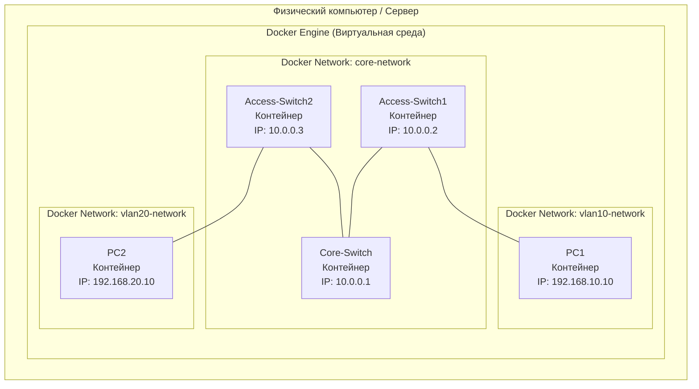
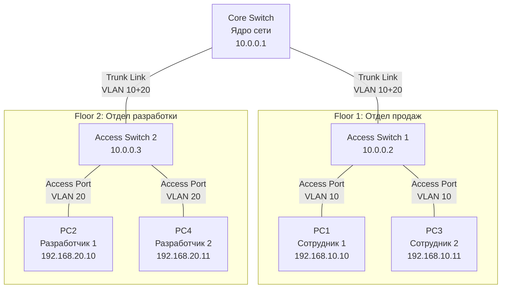
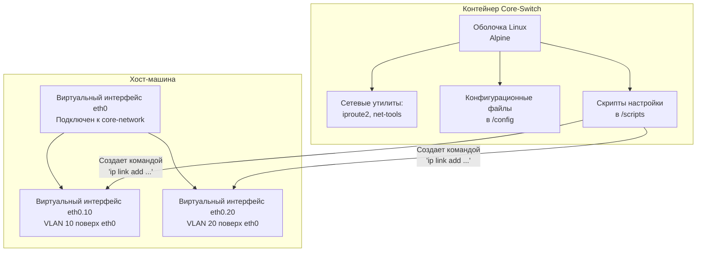
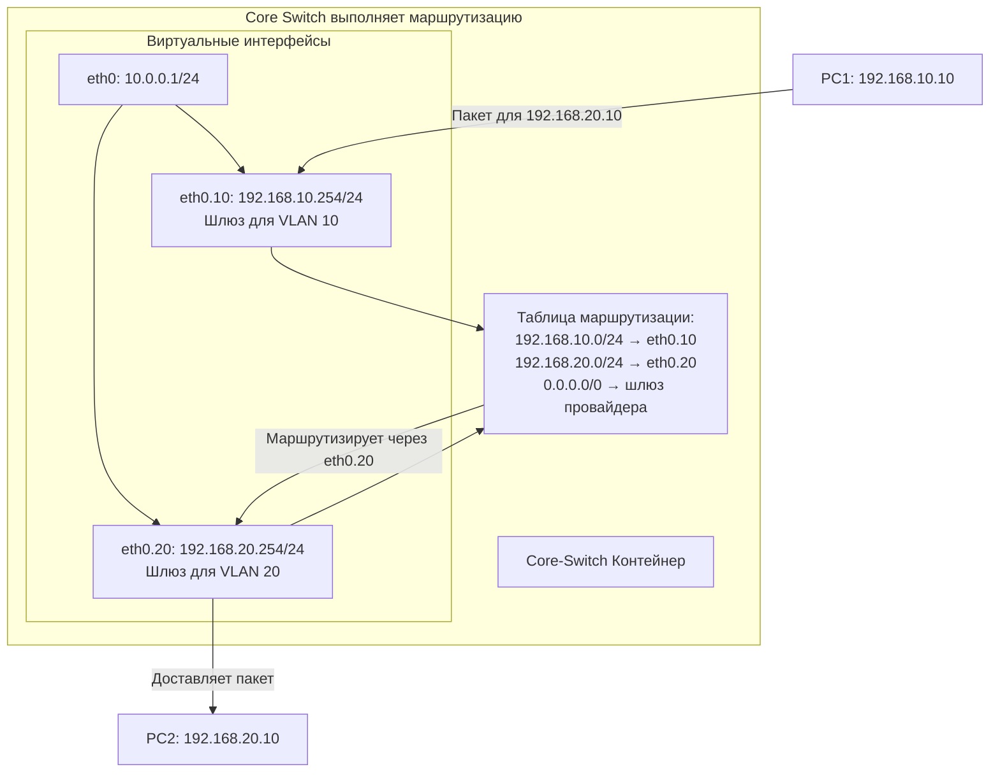
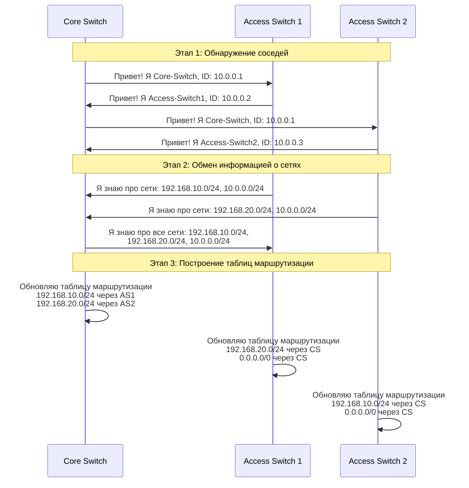

# Практическая работа настройки минимальной корпоративной сети с использованием docker
## 🎯 **Что мы будем делать?**

Представьте, что мы строим **миниатюрную корпоративную сеть** в компьютере, как будто играем в "цифровой конструктор" сети. Вместо настоящих железных коробок (свитчей и маршрутизаторов) мы используем **программные контейнеры** (Docker).

---

## 📊 **Диаграмма 1: Общая архитектура проекта**



**Простыми словами:**
- У нас есть один компьютер (ваш ноутбук/ПК)
- На нем запущена программа Docker (как "виртуальный песочница")
- Внутри Docker мы создаем 5 виртуальных "коробочек" (контейнеров):
  - 3 "свитча" (коммутатора)
  - 2 "компьютера" (клиентских устройства)

---

## 🏗️ **Диаграмма 2: Логическая архитектура сети**



**Аналогия из реальной жизни:**
- **Core Switch** = Главный распределительный щит в здании
- **Access Switch** = Этажный распределительный щит
- **PC** = Розетки в кабинетах
- **VLAN** = Разные "этажи" или "отделы" в здании

---

## 🔧 **Диаграмма 3: Как VLAN разделяют сеть**

```mermaid
graph LR
    subgraph "Физически: Один кабель"
        direction LR
        Cable[Физический кабель Ethernet]
    end
    
    Cable --> VLANs
    
    subgraph "Логически: Два виртуальных канала"
        direction LR
        VLAN10[VLAN 10: Красный "тоннель"<br/>Для отдела продаж]
        VLAN20[VLAN 20: Синий "тоннель"<br/>Для отдела разработки]
    end
    
    VLAN10 --> Traffic10[Трафик продаж:<br/>- Клиентские данные<br/>- CRM система]
    VLAN20 --> Traffic20[Трафик разработки:<br/>- Исходный код<br/>- Серверы тестирования]
```

**Объяснение для новичка:**
Представьте большую трубу (физический кабель), внутри которой проложены две маленькие трубочки разного цвета:
- **Красная трубочка (VLAN 10)** - только для отдела продаж
- **Синяя трубочка (VLAN 20)** - только для отдела разработки

Даже если труба одна, данные из разных отделов **не смешиваются**, как вода в разных трубочках.

---

## 🐳 **Диаграмма 4: Как Docker эмулирует сетевые устройства**



**Как это работает технически:**
1. Каждый "свитч" - это просто легковесный Linux-контейнер
2. Внутри контейнера есть стандартные сетевые инструменты
3. Мы "обманываем" систему, заставляя ее думать, что это сетевое устройство
4. VLAN создаются как **виртуальные интерфейсы** поверх физических

---

## 🛣️ **Диаграмма 5: Маршрутизация между VLAN (Router-on-a-Stick)**



**Простыми словами:**
Когда PC1 (продажи) хочет отправить данные PC2 (разработка):
1. PC1 отправляет пакет на свой шлюз (192.168.10.254)
2. Core-Switch получает пакет через интерфейс VLAN 10
3. Смотрит в таблицу маршрутизации: "Куда отправить пакет для 192.168.20.x?"
4. Находит: "Отправить через интерфейс VLAN 20"
5. Пересылает пакет через eth0.20 к PC2

---

## 🔄 **Диаграмма 6: Динамическая маршрутизация OSPF**



**Зачем это нужно?**
- **Без OSPF**: Если добавим новый свитч, нужно вручную добавлять маршруты на всех устройствах
- **С OSPF**: Добавили новый свитч → он сам "представится" соседям → все автоматически узнают о его сетях

---

## 📁 **Диаграмма 7: Структура файлов проекта**

```
cisco-enterprise-lab/
├── 📄 docker-compose.yml          # Главный файл развертывания
├── 📄 Dockerfile.cisco-base       # Шаблон для сетевых устройств
├── 📁 configs/                    # Конфигурации устройств
│   ├── 📁 core-switch/
│   ├── 📁 access-switch1/
│   └── 📁 access-switch2/
├── 📁 scripts/                    # Скрипты автоматизации
│   ├── 📄 network-setup.sh        # Настройка сети
│   ├── 📄 ospf-setup.sh          # Настройка OSPF
│   └── 📄 acl-setup.sh           # Настройка фаервола
└── 📄 README.md                   # Документация
```

---

## 🎬 **Пошаговое объяснение того, что мы делаем:**

### **ШАГ 1: Подготовка "строительной площадки"**
- Устанавливаем Docker (как строительный кран)
- Создаем чертежи (Dockerfile и docker-compose.yml)
- Готовим инструменты (сетевые утилиты)

### **ШАГ 2: Создание "виртуальных зданий"**
- Запускаем контейнеры (строим виртуальные устройства)
- Каждое устройство получает имя и IP-адрес (как табличка на здании)
- Создаем виртуальные сети (как прокладываем улицы между зданиями)

### **ШАГ 3: Настройка "этажей и лифтов" (VLAN)**
- Разделяем сеть на логические сегменты (VLAN)
- Настраиваем "транковые" соединения (лифты между этажами)
- Каждому отделу (VLAN) даем свою подсеть

### **ШАГ 4: Настройка "навигационной системы" (Маршрутизация)**
- Указываем, как данные должны перемещаться между VLAN
- Настраиваем шлюзы по умолчанию (главные выходы из здания)
- Включаем динамическую маршрутизацию OSPF (систему автонавигации)

### **ШАГ 5: Тестирование "дорожного движения"**
- Проверяем, могут ли "компьютеры" общаться друг с другом
- Тестируем связь между разными VLAN
- Проверяем работу OSPF (автонавигации)

### **ШАГ 6: Установка "пропускных пунктов" (Безопасность)**
- Настраиваем фаерволы (проверка документов)
- Настраиваем ACL (списки контроля доступа)
- Логируем подозрительную активность

---

## 🧩 **Ключевые концепции для новичка:**

### **1. Контейнер vs Виртуальная машина**
```
Виртуальная машина:          Контейнер:
┌─────────────────┐         ┌─────────────────┐
│  Приложение A   │         │  Приложение A   │
│  Библиотеки     │         │  Библиотеки     │
├─────────────────┤         ├─────────────────┤
│  Гостевая ОС    │         │                 │
├─────────────────┤         │    Движок       │
│  Гипервизор     │         │   Контейнеров   │
├─────────────────┤         ├─────────────────┤
│  Хостовая ОС    │         │   Хостовая ОС   │
└─────────────────┘         └─────────────────┘
```

### **2. VLAN - Виртуальные локальные сети**
```
Физическая сеть:            VLAN:
┌──────┬──────┬──────┐     ┌──────┬──────┬──────┐
│ PC1  │ PC2  │ PC3  │     │ PC1  │      │ PC3  │  ← VLAN 10 (Красный)
├──────┼──────┼──────┤     ├──────┤      ├──────┤
│ PC4  │ PC5  │ PC6  │     │      │ PC5  │      │  ← VLAN 20 (Синий)
└──────┴──────┴──────┘     └──────┴──────┴──────┘
Свитч                       Свитч с VLAN
```

### **3. Docker сети - как они работают**
```
Контейнер A                 Контейнер B
     ↓                            ↓
eth0@if15                   eth0@if16
     ↓                            ↓
vethxxxxxx <─────────────> vethyyyyyy
     ↓                            ↓
Докер-мост (docker0)
     ↓
Физический интерфейс
```

---

## 💡 **Практическая польза от этой лабораторной:**

1. **Без риска**: Можно делать ошибки - не сломаете реальное оборудование
2. **Дешево**: Не нужно покупать железо за тысячи долларов
3. **Быстро**: Развертывание за минуты вместо часов
4. **Повторяемо**: Можно сохранить конфигурацию и воссоздать в любой момент
5. **Образовательно**: Видите, как работают технологии изнутри

---

## 🚀 **Что дальше после освоения основ?**

1. **Добавить больше устройств** (маршрутизаторы, фаерволы)
2. **Настроить IPv6** (следующее поколение интернета)
3. **Добавить Wi-Fi контроллеры** (беспроводные сети)
4. **Интегрировать с облаком** (AWS/Azure)
5. **Настроить мониторинг** (Zabbix, Prometheus)
6. **Автоматизировать через Ansible** (Infrastructure as Code)

---

**Итог:** Вы создаете полнофункциональную корпоративную сеть в миниатюре, которая работает по тем же принципам, что и сети в реальных компаниях, но внутри вашего компьютера! 
# Практическая работа: Моделирование корпоративной сети Cisco с использованием Docker

## Тема: Развертывание и конфигурация сетевых устройств Cisco в Docker-окружении

**Цель работы:** Освоить методику развертывания виртуальных образов сетевого оборудования Cisco в Docker и выполнить базовую настройку корпоративной сети.

### 1. Подготовительный этап

#### 1.1. Установка необходимого ПО

```bash
# Обновление пакетов
sudo apt-get update

# Установка Docker
sudo apt-get install -y docker.io docker-compose

# Добавление пользователя в группу docker
sudo usermod -aG docker $USER
newgrp docker

# Установка утилит для работы с сетями
sudo apt-get install -y bridge-utils net-tools iproute2
```

#### 1.2. Подготовка Docker-образов Cisco

Создаем директорию для проекта:

```bash
mkdir cisco-enterprise-lab
cd ciso-enterprise-lab
```

Создаем Dockerfile для кастомизированного образа:

```dockerfile
# Dockerfile.cisco-base
FROM alpine:latest

RUN apk add --no-cache \
    bash \
    iproute2 \
    net-tools \
    tcpdump \
    openssh \
    python3 \
    vim

# Создаем директории для конфигураций
RUN mkdir -p /config /scripts

WORKDIR /root
CMD ["/bin/bash"]
```

### 2. Создание топологии сети

#### 2.1. Архитектура сети

```
        [Core-Switch] (Docker Container)
            /       \
           /         \
  [Access-Switch1] [Access-Switch2]
         |             |
    [PC1-VLAN10]  [PC2-VLAN20]
```

#### 2.2. Docker Compose конфигурация

Создаем файл `docker-compose.yml`:

```yaml
version: '3.8'

services:
  core-switch:
    build:
      context: .
      dockerfile: Dockerfile.cisco-base
    container_name: core-switch
    hostname: Core-Switch
    cap_add:
      - NET_ADMIN
    networks:
      core-network:
        ipv4_address: 10.0.0.1
    volumes:
      - ./configs/core-switch:/config
      - ./scripts:/scripts
    tty: true
    stdin_open: true
    command: /bin/bash

  access-switch1:
    build:
      context: .
      dockerfile: Dockerfile.cisco-base
    container_name: access-switch1
    hostname: Access-Switch1
    cap_add:
      - NET_ADMIN
    networks:
      core-network:
        ipv4_address: 10.0.0.2
      vlan10-network:
        ipv4_address: 192.168.10.1
    volumes:
      - ./configs/access-switch1:/config
      - ./scripts:/scripts
    tty: true
    stdin_open: true
    command: /bin/bash

  access-switch2:
    build:
      context: .
      dockerfile: Dockerfile.cisco-base
    container_name: access-switch2
    hostname: Access-Switch2
    cap_add:
      - NET_ADMIN
    networks:
      core-network:
        ipv4_address: 10.0.0.3
      vlan20-network:
        ipv4_address: 192.168.20.1
    volumes:
      - ./configs/access-switch2:/config
      - ./scripts:/scripts
    tty: true
    stdin_open: true
    command: /bin/bash

  pc1:
    image: alpine:latest
    container_name: pc1
    hostname: PC1
    networks:
      vlan10-network:
        ipv4_address: 192.168.10.10
    command: sh -c "apk add iproute2 && tail -f /dev/null"

  pc2:
    image: alpine:latest
    container_name: pc2
    hostname: PC2
    networks:
      vlan20-network:
        ipv4_address: 192.168.20.10
    command: sh -c "apk add iproute2 && tail -f /dev/null"

networks:
  core-network:
    driver: bridge
    ipam:
      config:
        - subnet: 10.0.0.0/24
  vlan10-network:
    driver: bridge
    ipam:
      config:
        - subnet: 192.168.10.0/24
  vlan20-network:
    driver: bridge
    ipam:
      config:
        - subnet: 192.168.20.0/24
```

### 3. Создание скриптов настройки

#### 3.1. Скрипт инициализации сети

Создаем файл `scripts/network-setup.sh`:

```bash
#!/bin/bash
# Скрипт настройки сетевых интерфейсов в контейнерах

# Функция для настройки Core Switch
setup_core_switch() {
    echo "Настройка Core Switch..."
    
    # Добавляем VLAN интерфейсы
    ip link add link eth0 name eth0.10 type vlan id 10
    ip link add link eth0 name eth0.20 type vlan id 20
    
    # Поднимаем интерфейсы
    ip link set eth0.10 up
    ip link set eth0.20 up
    
    # Назначаем IP адреса
    ip addr add 10.0.0.1/24 dev eth0
    ip addr add 192.168.10.254/24 dev eth0.10
    ip addr add 192.168.20.254/24 dev eth0.20
    
    # Включаем маршрутизацию
    echo 1 > /proc/sys/net/ipv4/ip_forward
    
    # Добавляем статические маршруты
    ip route add 192.168.10.0/24 via 10.0.0.2
    ip route add 192.168.20.0/24 via 10.0.0.3
    
    echo "Core Switch настроен"
}

# Функция для настройки Access Switch 1
setup_access_switch1() {
    echo "Настройка Access Switch 1..."
    
    # Создаем VLAN интерфейс
    ip link add link eth0 name eth0.10 type vlan id 10
    
    # Поднимаем интерфейсы
    ip link set eth0.10 up
    ip link set eth1 up
    
    # Назначаем IP адреса
    ip addr add 10.0.0.2/24 dev eth0
    ip addr add 192.168.10.1/24 dev eth0.10
    
    # Включаем маршрутизацию
    echo 1 > /proc/sys/net/ipv4/ip_forward
    
    # Маршрут по умолчанию
    ip route add default via 10.0.0.1
    
    echo "Access Switch 1 настроен"
}

# Функция для настройки Access Switch 2
setup_access_switch2() {
    echo "Настройка Access Switch 2..."
    
    # Создаем VLAN интерфейс
    ip link add link eth0 name eth0.20 type vlan id 20
    
    # Поднимаем интерфейсы
    ip link set eth0.20 up
    ip link set eth1 up
    
    # Назначаем IP адреса
    ip addr add 10.0.0.3/24 dev eth0
    ip addr add 192.168.20.1/24 dev eth0.20
    
    # Включаем маршрутизацию
    echo 1 > /proc/sys/net/ipv4/ip_forward
    
    # Маршрут по умолчанию
    ip route add default via 10.0.0.1
    
    echo "Access Switch 2 настроен"
}

# Определяем какой контейнер настраиваем
case $(hostname) in
    "Core-Switch")
        setup_core_switch
        ;;
    "Access-Switch1")
        setup_access_switch1
        ;;
    "Access-Switch2")
        setup_access_switch2
        ;;
    *)
        echo "Неизвестное устройство"
        ;;
esac
```

#### 3.2. Скрипт настройки OSPF

Создаем файл `scripts/ospf-setup.sh`:

```bash
#!/bin/bash
# Настройка OSPF протокола маршрутизации

install_bird() {
    echo "Установка BIRD для эмуляции OSPF..."
    apk add --no-cache bird
}

configure_bird_core() {
    cat > /etc/bird.conf << EOF
router id 10.0.0.1;

protocol kernel {
    persist;
    scan time 20;
    export all;
}

protocol device {
    scan time 10;
}

protocol ospf {
    area 0.0.0.0 {
        network 10.0.0.0/24;
        network 192.168.10.0/24;
        network 192.168.20.0/24;
    };
    import all;
    export all;
}
EOF
}

configure_bird_access1() {
    cat > /etc/bird.conf << EOF
router id 10.0.0.2;

protocol kernel {
    persist;
    scan time 20;
    export all;
}

protocol device {
    scan time 10;
}

protocol ospf {
    area 0.0.0.0 {
        network 10.0.0.0/24;
        network 192.168.10.0/24;
    };
    import all;
    export all;
}
EOF
}

configure_bird_access2() {
    cat > /etc/bird.conf << EOF
router id 10.0.0.3;

protocol kernel {
    persist;
    scan time 20;
    export all;
}

protocol device {
    scan time 10;
}

protocol ospf {
    area 0.0.0.0 {
        network 10.0.0.0/24;
        network 192.168.20.0/24;
    };
    import all;
    export all;
}
EOF
}

# Основной скрипт
case $(hostname) in
    "Core-Switch")
        install_bird
        configure_bird_core
        bird -c /etc/bird.conf
        ;;
    "Access-Switch1")
        install_bird
        configure_bird_access1
        bird -c /etc/bird.conf
        ;;
    "Access-Switch2")
        install_bird
        configure_bird_access2
        bird -c /etc/bird.conf
        ;;
esac

echo "OSPF настроен на $(hostname)"
```

### 4. Практические задания

#### Задание 1: Развертывание инфраструктуры

```bash
# Сборка и запуск контейнеров
docker-compose build
docker-compose up -d

# Проверка состояния контейнеров
docker-compose ps

# Просмотр логов
docker-compose logs -f
```

#### Задание 2: Базовая настройка сети

1. Зайдите в каждый контейнер и запустите скрипт настройки:

```bash
# Для Core Switch
docker exec -it core-switch /bin/bash
chmod +x /scripts/network-setup.sh
/scripts/network-setup.sh

# Для Access Switch 1
docker exec -it access-switch1 /bin/bash
chmod +x /scripts/network-setup.sh
/scripts/network-setup.sh

# Для Access Switch 2
docker exec -it access-switch2 /bin/bash
chmod +x /scripts/network-setup.sh
/scripts/network-setup.sh
```

2. Проверьте конфигурацию сети:

```bash
# Проверка IP адресов
ip addr show

# Проверка таблицы маршрутизации
ip route show

# Проверка связности
ping -c 4 10.0.0.2
```

#### Задание 3: Настройка OSPF

```bash
# На всех свитчах выполните
chmod +x /scripts/ospf-setup.sh
/scripts/ospf-setup.sh
```

#### Задание 4: Тестирование сети

1. Проверьте связность между VLAN:

```bash
# Из PC1 проверьте доступность PC2
docker exec -it pc1 ping 192.168.20.10

# Из PC2 проверьте доступность PC1
docker exec -it pc2 ping 192.168.10.10
```

2. Проверьте таблицу маршрутизации OSPF:

```bash
docker exec core-switch birdc show ospf neighbors
docker exec core-switch birdc show route
```

#### Задание 5: Настройка ACL (Access Control List)

Создайте файл `scripts/acl-setup.sh`:

```bash
#!/bin/bash
# Настройка базового ACL

setup_firewall() {
    echo "Настройка базового фаервола..."
    
    # Очистка правил
    iptables -F
    iptables -X
    
    # Политика по умолчанию
    iptables -P INPUT DROP
    iptables -P FORWARD DROP
    iptables -P OUTPUT ACCEPT
    
    # Разрешить loopback
    iptables -A INPUT -i lo -j ACCEPT
    
    # Разрешить установленные соединения
    iptables -A INPUT -m state --state ESTABLISHED,RELATED -j ACCEPT
    iptables -A FORWARD -m state --state ESTABLISHED,RELATED -j ACCEPT
    
    # Разрешить ICMP (ping)
    iptables -A INPUT -p icmp -j ACCEPT
    iptables -A FORWARD -p icmp -j ACCEPT
    
    # Разрешить SSH
    iptables -A INPUT -p tcp --dport 22 -j ACCEPT
    
    # Правила для Core Switch
    if [ "$(hostname)" = "Core-Switch" ]; then
        # Разрешить трафик между VLAN
        iptables -A FORWARD -s 192.168.10.0/24 -d 192.168.20.0/24 -j ACCEPT
        iptables -A FORWARD -s 192.168.20.0/24 -d 192.168.10.0/24 -j ACCEPT
        
        # Логирование запрещенного трафика
        iptables -A FORWARD -j LOG --log-prefix "FORWARD-DROP: "
    fi
    
    echo "Фаервол настроен на $(hostname)"
}

setup_firewall
```

### 5. Контрольные вопросы

1. Какие преимущества дает использование Docker для моделирования сетей?
2. Как организована маршрутизация между VLAN в данной лабораторной работе?
3. Каким образом реализована изоляция трафика разных VLAN?
4. Что такое OSPF и зачем он используется в корпоративных сетях?
5. Как можно масштабировать данную конфигурацию для большего количества устройств?

### 6. Дополнительные задания

1. Добавьте еще один Access Switch и настройте для него VLAN 30
2. Реализуйте настройку DHCP сервера для автоматической раздачи IP-адресов
3. Настройте мониторинг сети с помощью SNMP
4. Реализуйте отказоустойчивость с использованием HSRP/VRRP
5. Настройте QoS для приоритизации голосового трафика

### 7. Очистка окружения

```bash
# Остановка и удаление контейнеров
docker-compose down

# Удаление образов
docker rmi cisco-enterprise-lab_core-switch
docker rmi cisco-enterprise-lab_access-switch1
docker rmi cisco-enterprise-lab_access-switch2

# Удаление сетей (если остались)
docker network prune -f
```

## Заключение

Данная практическая работа демонстрирует основные принципы моделирования корпоративной сети Cisco с использованием Docker. Вы освоили:

1. Развертывание виртуальных сетевых устройств в контейнерах
2. Настройку базовой сетевой инфраструктуры
3. Конфигурацию VLAN и маршрутизации между ними
4. Настройку динамической маршрутизации OSPF
5. Реализацию базовых механизмов безопасности

Полученные навыки могут быть применены для тестирования конфигураций, отработки сценариев миграции и обучения сетевым технологиям Cisco в изолированной среде.