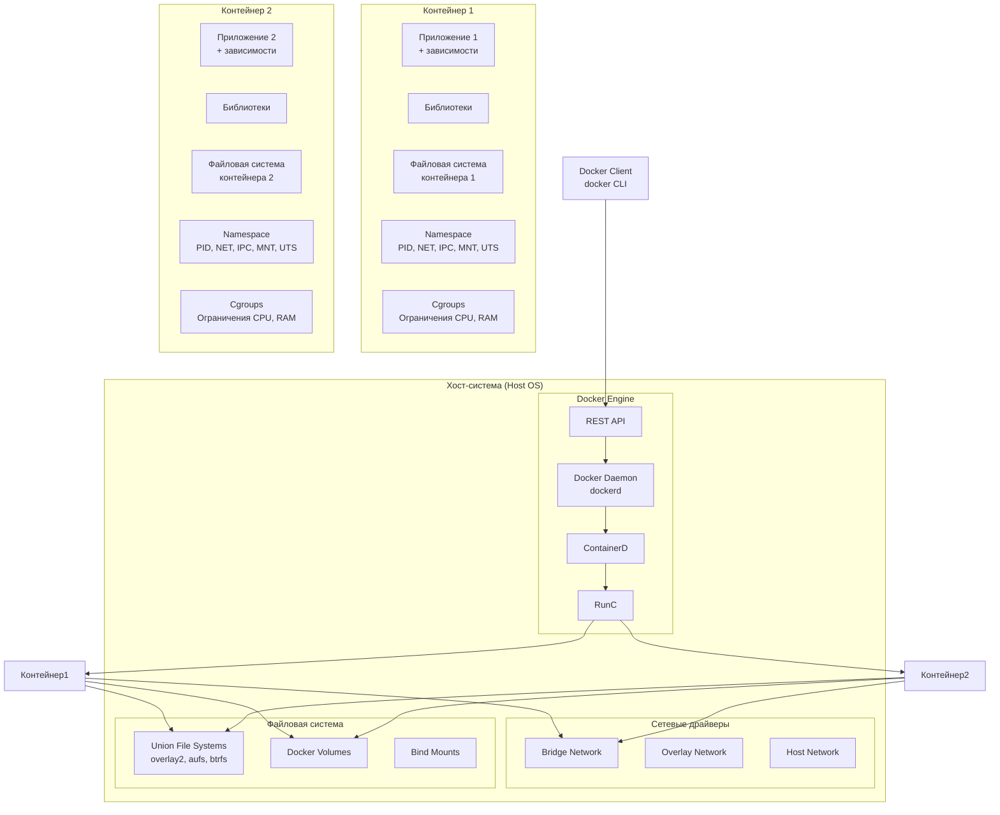
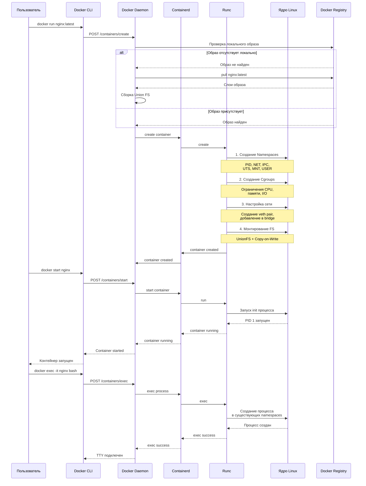
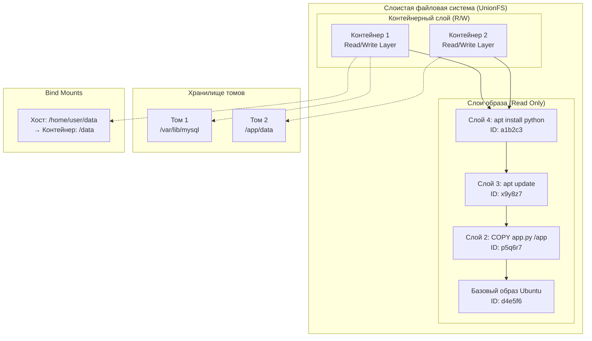
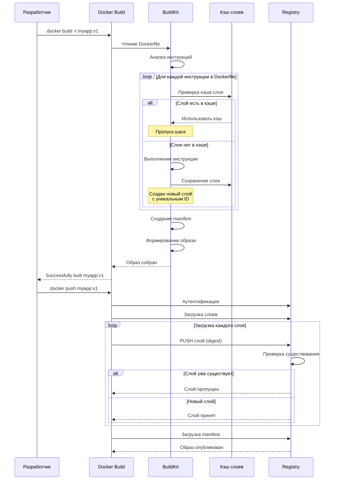

# Как устроены Docker контейнеры: архитектура и процессы

## 1. Архитектурная диаграмма Docker



## 2. Диаграмма последовательности: Жизненный цикл контейнера



## 3. Диаграмма слоев файловой системы Docker



## 4. Диаграмма сетевой архитектуры Docker

```mermaid
graph TB
    subgraph "Хост-система"
        Eth0[eth0: 192.168.1.100]
        Docker0[docker0 bridge<br/>172.17.0.1/16]
        
        subgraph "Network Namespace 1"
            Veth1[veth12345@if2]
            EthC1[eth0@контейнер<br/>172.17.0.2/16]
            Container1[Контейнер 1<br/>nginx:80]
        end
        
        subgraph "Network Namespace 2"
            Veth2[veth67890@if2]
            EthC2[eth0@контейнер<br/>172.17.0.3/16]
            Container2[Контейнер 2<br/>app:5000]
        end
    end
    
    subgraph "Внешняя сеть"
        Internet[Интернет]
        Client[Клиент<br/>192.168.1.50]
    end
    
    Client --> Eth0
    Eth0 --> Docker0
    Docker0 --> Veth1
    Docker0 --> Veth2
    Veth1 --> EthC1
    Veth2 --> EthC2
    
    EthC1 --> Container1
    EthC2 --> Container2
    
    Container1 -- "Внутренняя связь" --> Container2
    
    %% iptables правила
    subgraph "IPTables правила"
        NAT[SNAT/MASQUERADE<br/>для исходящего трафика]
        DNAT[DNAT<br/>-p tcp --dport 8080<br/>→ 172.17.0.2:80]
        FORWARD[FORWARD цепочка<br/>между bridge и eth0]
    end
    
    Docker0 -.-> NAT
    Docker0 -.-> DNAT
    Docker0 -.-> FORWARD
```

## 5. Диаграмма последовательности: Построение образа Docker



## Объяснение ключевых компонентов:

### 1. **Namespaces** (пространства имен)
- **PID namespace**: Изоляция процессов (контейнер видит только свои процессы)
- **NET namespace**: Изоляция сети (свои интерфейсы, IP, таблицы маршрутизации)
- **IPC namespace**: Изоляция межпроцессного взаимодействия
- **MNT namespace**: Изоляция точек монтирования файловой системы
- **UTS namespace**: Изоляция hostname и domainname
- **USER namespace**: Изоляция UID/GID (отображение пользователей)

### 2. **Cgroups** (control groups)
- Ограничение ресурсов:
  - CPU shares и quotas
  - Memory limits и swap
  - I/O bandwidth
  - Network priority
- Учет потребления ресурсов
- Заморозка/возобновление процессов

### 3. **Union File System**
- Слоистая архитектура:
  - Базовый слой (образ ОС)
  - Слои зависимостей (apt install, npm install)
  - Слой приложения (COPY, ADD)
  - Контейнерный слой (read-write)
- Copy-on-Write (CoW):
  - Слои только для чтения
  - Изменения записываются в верхний R/W слой

### 4. **Сетевая модель**
- Bridge сеть (docker0):
  - NAT для исходящих соединений
  - Порт форвардинг для входящих
- Host сеть:
  - Использование сетевого стека хоста
- Overlay сети:
  - Для Docker Swarm кластеров
- Macvlan:
  - Прямое выделение MAC адресов

### 5. **Архитектурные компоненты**
- **Docker CLI**: Интерфейс командной строки
- **Docker Daemon** (dockerd): Фоновый процесс, управляющий контейнерами
- **containerd**: Менеджер жизненного цикла контейнеров
- **runc**: Спецификация OCI, низкоуровневый рантайм
- **BuildKit**: Система сборки образов

### 6. **Изоляция vs Виртуализация**
```
Виртуализация (VM):           Контейнеры (Docker):
+------------------+          +------------------+
|     App A        |          |     App A        |
+------------------+          +------------------+
|   Библиотеки     |          |   Библиотеки     |
+------------------+          +------------------+
|   Guest OS A     |          |   Container      |
+------------------+          |     Runtime      |
|   Hypervisor     |          +------------------+
+------------------+          |    Host OS       |
|   Host OS        |          +------------------+
+------------------+          |   Hardware       |
|   Hardware       |          +------------------+
+------------------+
```

**Ключевые отличия:**
- Контейнеры разделяют ядро хоста
- Запуск за секунды (не минуты)
- Минимальный оверхед (1-5% vs 10-20% у VM)
- Портабельность: "build once, run anywhere"

Эта архитектура делает Docker легковесным, быстрым и портативным решением для контейнеризации приложений.