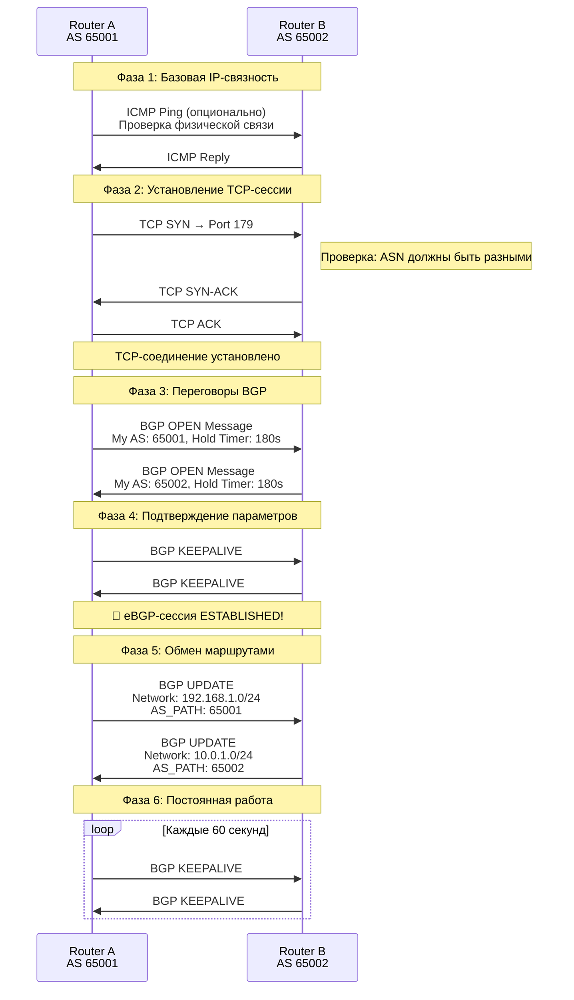
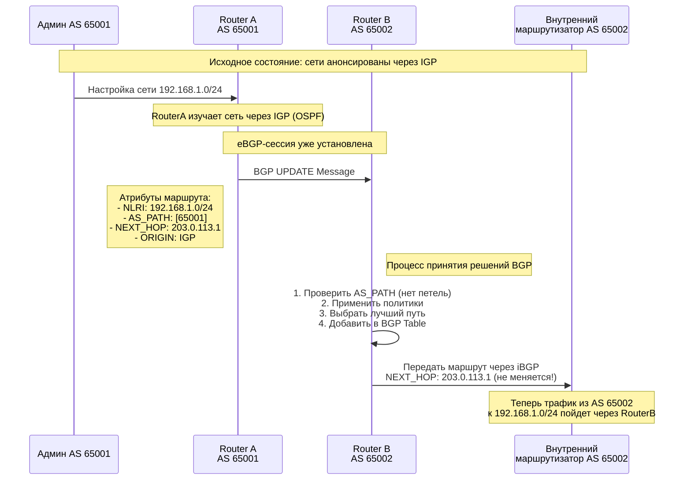
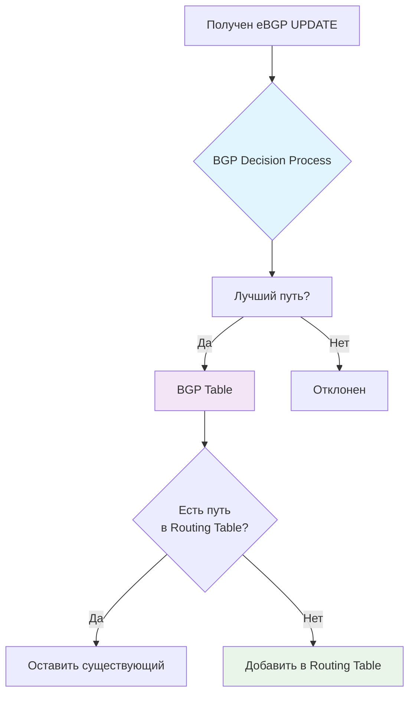
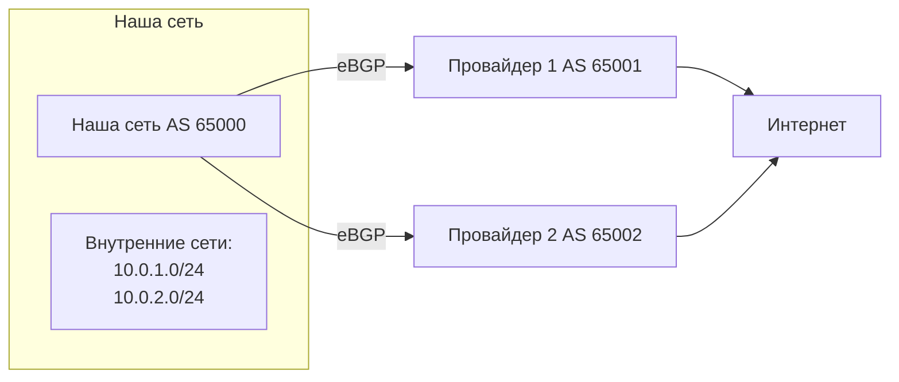

eBGP.md


## Что такое eBGP?

**eBGP (external BGP)** - это протокол для обмена маршрутной информацией **между разными Автономными Системами (AS)**. 

**Простая аналогия:** Представьте, что каждая AS - это отдельное государство, а eBGP - это язык дипломатии, на котором пограничные пункты разных стран обмениваются информацией о том, какие территории доступны через их границы.

---

## Основные принципы eBGP

### 1. Участники eBGP-сессии
- Два маршрутизатора из **РАЗНЫХ AS**
- Обычно находятся "на границе" своих автономных систем
- Имеют прямую IP-связность (часто через интерфейсы "лицом к лицу")

### 2. Отличия от iBGP
| eBGP | iBGP |
|------|------|
| Между разными AS | Внутри одной AS |
| TTL = 1 (по умолчанию) | TTL = 255 |
| Изменяет AS_PATH | Не изменяет AS_PATH |
| Обычно прямое соединение | Может быть через несколько хопов |

---

## Как работает eBGP: Полный процесс

### Диаграмма последовательности установления eBGP-сессии



---

## Детальное объяснение каждого этапа

### Этап 1: Предварительные условия
Перед установкой eBGP-сессии должны быть выполнены:
1. **Физическая связность** - кабели, оптические линии
2. **IP-связность** - маршрутизаторы должны "пинговаться"
3. **Настройка BGP** - прописаны соседи, ASN и т.д.

### Этап 2: Установление TCP-сессии
- BGP использует **TCP порт 179**
- Один из маршрутизаторов становится TCP-сервером, другой - клиентом
- **TTL=1** - защита от установления сессии через промежуточные маршрутизаторы

### Этап 3: BGP OPEN Message
Каждый маршрутизатор отправляет OPEN-сообщение с параметрами:
```
BGP OPEN Message:
- BGP Version: 4
- My Autonomous System: 65001
- Hold Time: 180 секунд
- BGP Identifier: 1.1.1.1 (Router ID)
```

### Этап 4: Обмен маршрутами (UPDATE Messages)

Давайте посмотрим подробнее на процесс обмена маршрутами:



---

## Ключевые особенности eBGP

### 1. Изменение AS_PATH
Когда маршрут проходит через eBGP-сессию:
```
Исходно:   NETWORK 192.168.1.0/24, AS_PATH: [65001]
После eBGP: NETWORK 192.168.1.0/24, AS_PATH: [65002, 65001]
```
⬆️ Добавляется ASN соседа в начало списка

### 2. Next Hop Behavior
- В eBGP NEXT_HOP всегда меняется на IP-адрес eBGP-соседа
- Это критически важное отличие от iBGP

### 3. BGP Table vs Routing Table


---

## Практический пример: Multi-Homed сеть

Рассмотрим сеть, подключенную к двум разным провайдерам:



**Анонсируем наши сети провайдерам:**
```bash
# На Router A к Провайдеру 1
BGP UPDATE to AS 65001:
- Networks: 10.0.1.0/24, 10.0.2.0/24  
- AS_PATH: [65000]
- LOCAL_PREF: 100 (для исходящего трафика)

# На Router A к Провайдеру 2  
BGP UPDATE to AS 65002:
- Networks: 10.0.1.0/24, 10.0.2.0/24
- AS_PATH: [65000]
- LOCAL_PREF: 50 (резервный канал)
```

---

## Типичные проблемы eBGP для новичков

### 1. "Сессия не устанавливается"
- **Причина:** Нет IP-связности между BGP-пирами
- **Решение:** Проверить ping, ACL, firewall правила

### 2. "Маршруты не передаются"
- **Причина:** Сети не объявлены в BGP через `network` statement
- **Решение:** Явно объявить сети или использовать redistribution

### 3. "AS_PATH loop detected"
- **Причина:** Маршрут вернулся в AS, где он уже был
- **Решение:** BGP автоматически отбрасывает такой маршрут - это нормально!

### 4. "Next Hop недоступен"
- **Причина:** Для NEXT_HOP из eBGP-анонса нет маршрута в IGP
- **Решение:** Использовать `next-hop-self` или статический маршрут

## Резюме

1. **eBGP = "Внешние отношения"** между разными автономными системами
2. **Работает поверх TCP** - надежно, но медленнее IGP
3. **TTL=1** - защита от "случайных" сессий
4. **Изменяет AS_PATH** - добавляет свой ASN при экспорте маршрутов
5. **Использует сложный decision process** для выбора лучшего пути
6. **Требует ручной настройки** соседей и политик

