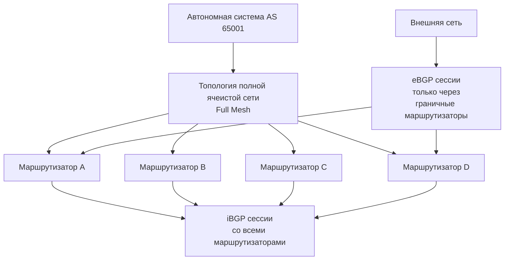
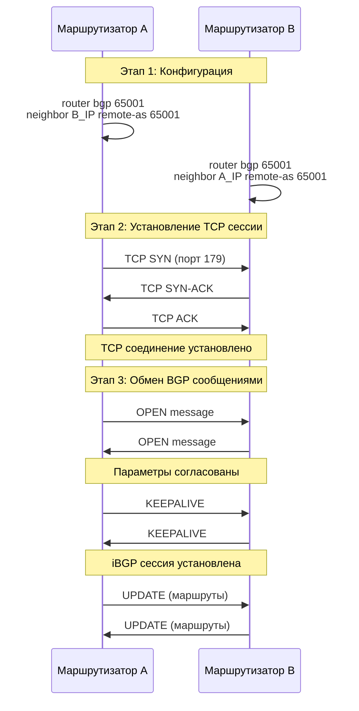
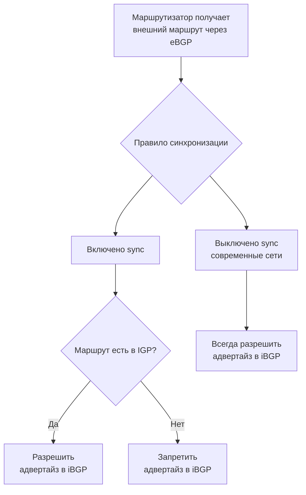
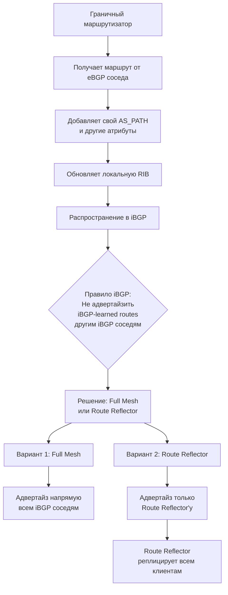
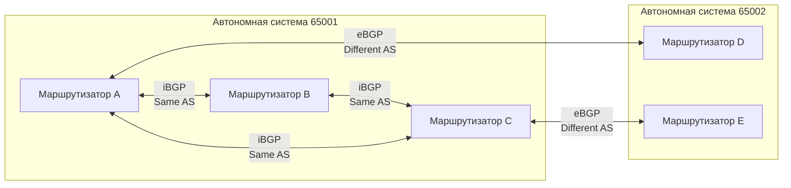
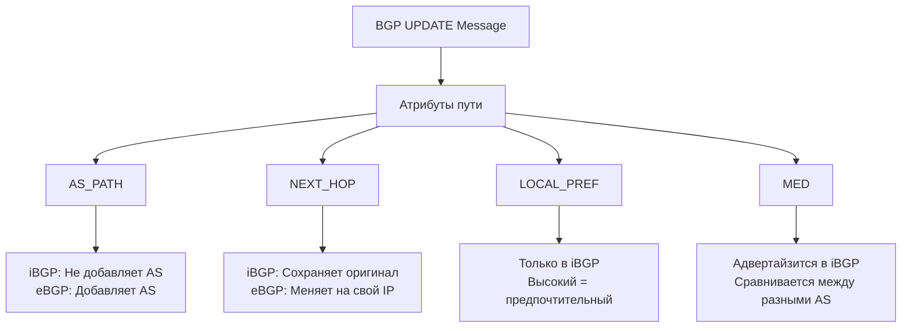
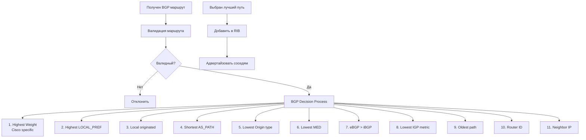
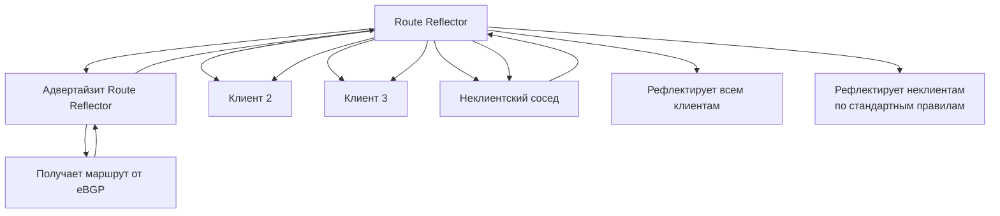
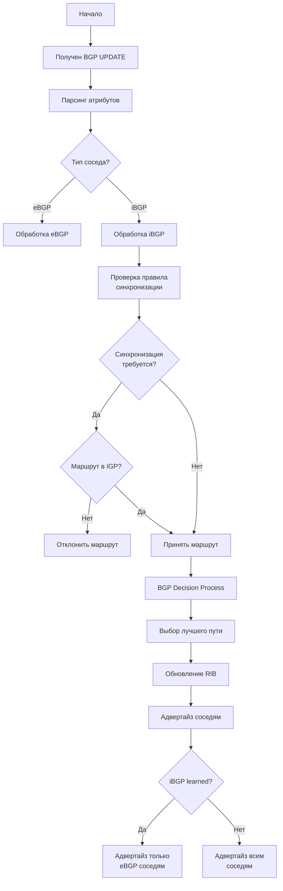

## 1. Что такое iBGP?

**iBGP (Internal BGP)** - это протокол для обмена маршрутной информацией **внутри одной автономной системы (AS)**.

## 2. Основная архитектура iBGP



## 3. Процесс установления iBGP сессии



## 4. Правило синхронизации iBGP



## 5. Процесс распространения маршрута через iBGP



## 6. Сравнение iBGP и eBGP



## 7. Атрибуты BGP в iBGP



## 8. Процесс принятия решений в iBGP



## 9. Пример работы Route Reflector



## 10. Полный процесс обработки iBGP маршрута



## 11. Практический пример конфигурации

```bash
! Маршрутизатор A в AS 65001
router bgp 65001
 bgp router-id 1.1.1.1
 bgp log-neighbor-changes
 ! iBGP соседи
 neighbor 192.168.1.2 remote-as 65001
 neighbor 192.168.1.3 remote-as 65001
 ! eBGP сосед
 neighbor 10.1.1.2 remote-as 65002
 ! Отключение синхронизации
 no synchronization
 ! Политика сети
 network 192.168.1.0 mask 255.255.255.0
```

## Ключевые особенности iBGP:

1. **Тот же AS номер** у всех участников
2. **Full Mesh требование** (без Route Reflector)
3. **Не изменяет AS_PATH** для внутренних маршрутов
4. **Сохраняет NEXT_HOP** от eBGP соседа
5. **Использует LOCAL_PREF** для управления трафиком внутри AS

iBGP обеспечивает согласованное распространение внешней маршрутной информации внутри автономной системы, работая поверх IGP (OSPF, EIGRP), который обеспечивает внутреннюю связность.